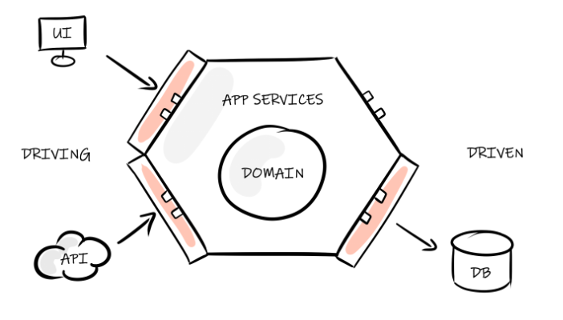

# 💰 **Bank Account** 💰

🌐 Available in :  
[🇫🇷 Français](README.md) | [🇬🇧 English](README.en.md)

# Subject

This kata is a [hexagonal architecture](https://en.wikipedia.org/wiki/Hexagonal_architecture_(software)) challenge
focused on the banking domain.

## ⚠️ Application Guidelines ⚠️

> This kata has two objectives:
> - First, to assess your technical skills as a candidate;
> - Second, to serve as a foundation for your onboarding if you join us :smile:.
>
> It is intentionally broad in scope.
>
> **In the first case (recruitment process), we understand that time is a precious and limited resource.
> That's why we offer three levels of commitment, depending on the time you can dedicate:**
>
> 1. You have little time (one evening): Focus only on the business code.
>    - Ensure it is tested and functional, with test adapters.
>    - **We will not hold it against you if you do not complete the other parts.**
>    - **We will discuss any uncovered elements during the technical interview.**
> 2. You have more time (several evenings): The business code, exposed via a REST API, and functional persistence; all thoroughly tested end-to-end.
> 3. You have plenty of time and want to go further: The same, with application containerization and a CI/CD pipeline ;p
>
> You will be evaluated on the following points:
>
> - All delivered code must be adequately tested (both passing and failing cases).
> - We will pay close attention to design, quality, and code readability (including commits).
>
> We understand that each candidate has different time constraints, and we will value your ability to prioritize and
> deliver quality work within the given time.

## Implementation Guidelines

> To complete this kata:
> - Create a branch from main.
> - Perform your development on this branch.
> - When you are ready to submit, open a merge request to main.
>
> ⚠️ Opening your merge request will trigger the code review!
>
> ⚠️ This merge request is for code review purposes, **DO NOT MERGE IT!**

### Feature 1: Bank Account

We want to implement a bank account feature.

The account must have:

- A unique account number (format is free).
- A balance.
- A deposit function.
- A withdrawal function.

The following business rule must be implemented:

- A withdrawal cannot be made if it exceeds the account balance.

__

### Feature 2: Overdraft

We want to implement an authorized overdraft system for bank accounts.
The following business rule must be implemented:

__

- If an account has an overdraft authorization, a withdrawal that exceeds the account balance is allowed, provided the
  final balance does not exceed the overdraft limit.

### Feature 3: Savings Account

We want to implement a savings account.

A savings account is a bank account that:

- Has a deposit ceiling: Money can only be deposited up to the account's ceiling (e.g., €22,950 for a Livret A).
- Cannot have an overdraft authorization.

__

### Feature 4: Account Statement

We want to implement a monthly account statement feature (rolling month) for account transactions.

The statement must show:

- The account type (Savings or Current Account).
- The account balance as of the statement date.
- The list of transactions on the account, sorted by date in reverse chronological order.

## Good luck!

